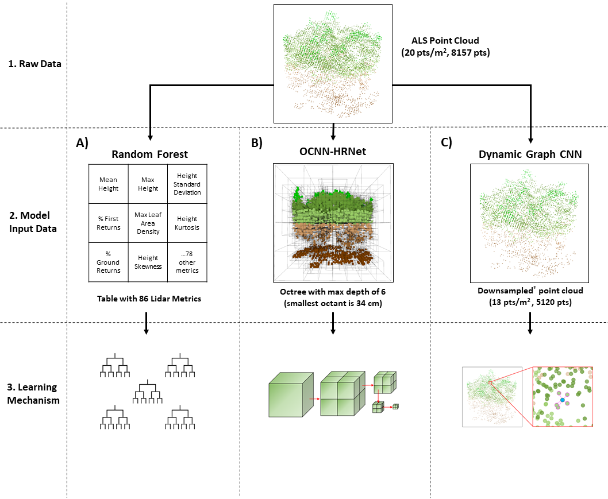

# Point Cloud Deep Learning for Tree Biomass Regression

## Purpose of Repository
This repository contains code used to train the Deep Neural Network (DNN) and Random Forest (RF) models from the study currently in review "Modelling Tree Biomass Using Direct and Additive Methods with Point Cloud Deep Learning in a Temperate Mixed Forest" by Seely et al. 2023. This repository should be used as a reference for more information relating to the specific model architectures, training regimes, or any other technical details of the analysis.

Please note that this repository is not set up as a python package. However, this code can serve as a useful reference for further research and application of point cloud deep learning for tree biomass regression.

## Visual Abstract

## Referenced Repositories
The following GitHub repos were essential in the development of the code used in this study:

- [DGCNN](https://github.com/WangYueFt/dgcnn)
- [OCNN-Pytorch](https://github.com/octree-nn/ocnn-pytorch)

